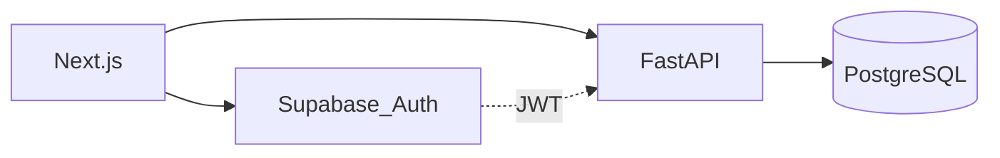
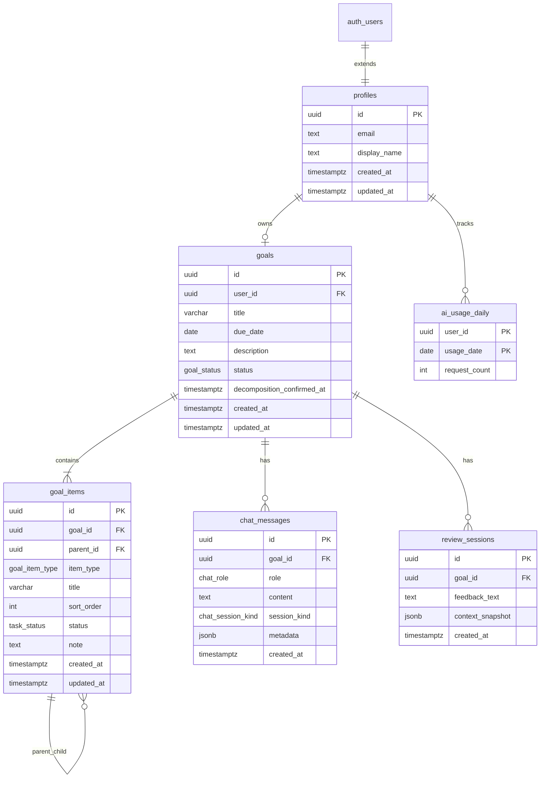
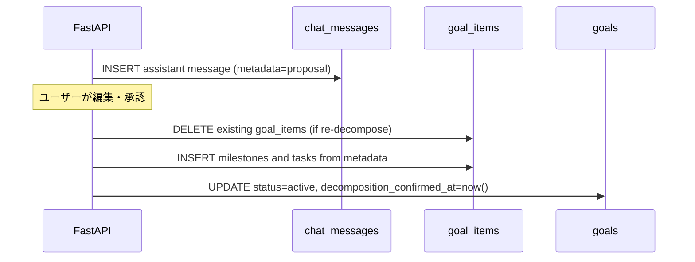

# DB 設計書

本ドキュメントは goal-ai-agent の MVP 向けデータベース（Supabase / PostgreSQL）の物理設計を定義する。

関連ドキュメント: [requirements.md](requirements.md)（要件・概念モデル）、[draft.md](draft.md)（技術前提）、[procedure.md](procedure.md)（開発工程）

---

## 1. 概要

### 1.1 目的

- [requirements.md](requirements.md) セクション11の概念エンティティを物理テーブルに落とし込む
- Row Level Security（RLS）と制約により、個人データの分離と MVP ビジネスルールを担保する
- 次工程「DDL,DMLを実装」で SQL 化できる粒度を提供する

### 1.2 技術前提

| 項目 | 内容 |
|------|------|
| DBMS | PostgreSQL（Supabase マネージド） |
| スキーマ | `public`（業務テーブル）、`auth`（Supabase Auth 管理） |
| 認証 | Supabase Auth（Google OAuth） |
| ID 型 | UUID（`gen_random_uuid()`） |

### 1.3 データアクセス方針



- **業務データ:** クライアントは **FastAPI のみ** 経由で CRUD する（要件確定）
- **認証:** Next.js が Supabase Auth で Google OAuth を行い、JWT を FastAPI に渡す
- **認可（正）:** FastAPI が JWT の `sub`（= `auth.users.id`）で全クエリをフィルタする
- **認可（防御）:** RLS を全業務テーブルに定義し、誤って anon key で直接公開した場合の漏洩を防ぐ
- FastAPI は接続に **service role** を使用可能とするが、RLS は有効のまま維持し、アプリケーション層でも `user_id` フィルタを必須とする

---

## 2. 命名規約

| 規則 | 例 |
|------|-----|
| テーブル名 | 複数形・スネークケース（`goals`, `goal_items`） |
| カラム名 | スネークケース（`user_id`, `created_at`） |
| 主キー | `id` UUID |
| 外部キー | `{参照先単数}_id`（`goal_id`, `parent_id`） |
| 日時 | `TIMESTAMPTZ`、列名 `created_at` / `updated_at` |
| 列挙型 | PostgreSQL `ENUM` 型（`goal_status` 等） |

---

## 3. 設計判断（ADR 要約）

| 論点 | 決定 | 理由 |
|------|------|------|
| ProgressLog（概念モデル） | **MVP では不採用** | FR-008/009 はタスクの現在状態のみ要求。履歴は将来 `progress_logs` を追加 |
| ReviewFeedback | **`review_sessions` に統合** | 1 セッション 1 FB 固定。`feedback_text` 列で表現 |
| 1 ユーザー 1 目標 | `goals.user_id` に **UNIQUE 制約** | FR-011 を DB で担保 |
| 進捗状態 | `goal_items.status` | PATCH progress の永続化先 |
| 分解ドラフト | **確定前は `chat_messages.metadata` に保持** | 確定時に `goal_items` へ一括 INSERT。未確定のゴミ行を防ぐ |
| 中項目・タスク件数上限 | **アプリ層**（各最大 20 件） | MVP では DB トリガーは不要。将来必要ならトリガー追加 |
| profiles 作成 | **`auth.users` INSERT 時の DB トリガー** | 初回ログイン時の race を避け、Supabase 慣習に合わせる |
| AI リクエスト上限 | `ai_usage_daily` テーブル | NFR-005。カウント更新ロジックはバックエンド工程 |

---

## 4. 物理 ER 図



`auth.users` は Supabase が管理するため、本設計書では参照のみとし、業務テーブルは重複定義しない。

---

## 5. 列挙型（ENUM）

| 型名 | 値 | 用途 |
|------|-----|------|
| `goal_status` | `draft`, `active`, `archived` | 目標のライフサイクル |
| `goal_item_type` | `milestone`, `task` | 中項目 / タスク |
| `task_status` | `not_started`, `in_progress`, `completed` | タスク進捗（FR-008） |
| `chat_role` | `user`, `assistant`, `system` | チャット発話者 |
| `chat_session_kind` | `coaching`, `decompose` | AI モード（要件 10.1） |

### goal_status の意味

| 値 | 説明 |
|----|------|
| `draft` | 作成直後・具体化・分解前 |
| `active` | 分解確定済み、進捗管理・振り返り対象 |
| `archived` | 完了またはユーザーによるアーカイブ（MVP では任意利用） |

---

## 6. テーブル定義

### 6.1 profiles

`auth.users` の拡張プロファイル。表示名などアプリ固有属性を保持する。

| カラム | 型 | NULL | DEFAULT | 制約・説明 |
|--------|-----|------|---------|------------|
| `id` | UUID | NO | — | PK, FK → `auth.users(id)` ON DELETE CASCADE |
| `email` | TEXT | YES | — | Auth から同期 |
| `display_name` | TEXT | YES | — | 最大 100 文字（アプリ検証） |
| `created_at` | TIMESTAMPTZ | NO | `now()` | |
| `updated_at` | TIMESTAMPTZ | NO | `now()` | |

**インデックス:** なし（PK 検索のみ）

---

### 6.2 goals

ユーザーが管理する目標。MVP では **1 ユーザー 1 件**。

| カラム | 型 | NULL | DEFAULT | 制約・説明 |
|--------|-----|------|---------|------------|
| `id` | UUID | NO | `gen_random_uuid()` | PK |
| `user_id` | UUID | NO | — | FK → `profiles(id)` ON DELETE CASCADE, **UNIQUE** |
| `title` | VARCHAR(200) | NO | — | FR-003 |
| `due_date` | DATE | NO | — | FR-003 |
| `description` | TEXT | YES | — | 最大 2000 文字（下記 CHECK） |
| `status` | `goal_status` | NO | `'draft'` | |
| `decomposition_confirmed_at` | TIMESTAMPTZ | YES | — | 分解確定日時 |
| `created_at` | TIMESTAMPTZ | NO | `now()` | |
| `updated_at` | TIMESTAMPTZ | NO | `now()` | |

**CHECK 制約:**

```sql
CONSTRAINT goals_description_length CHECK (
  description IS NULL OR char_length(description) <= 2000
)
```

**インデックス:**

| 名前 | 列 | 用途 |
|------|-----|------|
| `goals_user_id_idx` | `user_id` | ユーザー別目標取得（UNIQUE と兼用） |

---

### 6.3 goal_items

中項目（`milestone`）とタスク（`task`）の階層構造。最大 3 階層のうち中項目・タスク 2 段を表現する。

| カラム | 型 | NULL | DEFAULT | 制約・説明 |
|--------|-----|------|---------|------------|
| `id` | UUID | NO | `gen_random_uuid()` | PK |
| `goal_id` | UUID | NO | — | FK → `goals(id)` ON DELETE CASCADE |
| `parent_id` | UUID | YES | — | FK → `goal_items(id)` ON DELETE CASCADE |
| `item_type` | `goal_item_type` | NO | — | `milestone` / `task` |
| `title` | VARCHAR(200) | NO | — | |
| `sort_order` | INT | NO | `0` | 同一親内の表示順（0 始まり） |
| `status` | `task_status` | YES | — | **task のみ** NOT NULL |
| `note` | TEXT | YES | — | 進捗メモ（FR-008）、最大 500 文字（アプリ検証） |
| `created_at` | TIMESTAMPTZ | NO | `now()` | |
| `updated_at` | TIMESTAMPTZ | NO | `now()` | |

**CHECK 制約:**

```sql
-- 中項目: 親なし / タスク: 親あり
CONSTRAINT goal_items_parent_type CHECK (
  (item_type = 'milestone' AND parent_id IS NULL)
  OR
  (item_type = 'task' AND parent_id IS NOT NULL)
);

-- タスクのみ status 必須、中項目は status 不可
CONSTRAINT goal_items_status_by_type CHECK (
  (item_type = 'task' AND status IS NOT NULL)
  OR
  (item_type = 'milestone' AND status IS NULL)
);
```

**階層ルール（アプリ層で検証）:**

- `milestone` の `parent_id` は常に NULL（目標直下）
- `task` の `parent_id` は `item_type = 'milestone'` の行を参照
- 中項目・タスクはそれぞれ最大 20 件（FR-006/007）

**インデックス:**

| 名前 | 列 | 用途 |
|------|-----|------|
| `goal_items_goal_id_idx` | `goal_id` | 目標別一覧 |
| `goal_items_parent_id_idx` | `parent_id` | 中項目配下タスク取得 |
| `goal_items_goal_parent_sort_idx` | `goal_id`, `parent_id`, `sort_order` | ツリー表示 |

---

### 6.4 chat_messages

目標に紐づく AI 対話履歴（具体化・分解）。

| カラム | 型 | NULL | DEFAULT | 制約・説明 |
|--------|-----|------|---------|------------|
| `id` | UUID | NO | `gen_random_uuid()` | PK |
| `goal_id` | UUID | NO | — | FK → `goals(id)` ON DELETE CASCADE |
| `role` | `chat_role` | NO | — | |
| `content` | TEXT | NO | — | メッセージ本文 |
| `session_kind` | `chat_session_kind` | NO | — | `coaching` / `decompose` |
| `metadata` | JSONB | YES | — | 分解提案ドラフト等（下記スキーマ） |
| `created_at` | TIMESTAMPTZ | NO | `now()` | |

**metadata（分解ドラフト）の JSON スキーマ（論理）:**

```json
{
  "proposal_version": 1,
  "milestones": [
    {
      "title": "string",
      "sort_order": 0,
      "tasks": [
        { "title": "string", "sort_order": 0 }
      ]
    }
  ]
}
```

確定 API 実行時: 最新の `decompose` メッセージの `metadata` を読み、`goal_items` に INSERT 後、`goals.decomposition_confirmed_at` と `goals.status = 'active'` を更新する。

**インデックス:**

| 名前 | 列 | 用途 |
|------|-----|------|
| `chat_messages_goal_id_created_idx` | `goal_id`, `created_at` | 時系列チャット取得 |

---

### 6.5 review_sessions

振り返りセッションと AI フィードバック本文（ReviewFeedback を統合）。

| カラム | 型 | NULL | DEFAULT | 制約・説明 |
|--------|-----|------|---------|------------|
| `id` | UUID | NO | `gen_random_uuid()` | PK |
| `goal_id` | UUID | NO | — | FK → `goals(id)` ON DELETE CASCADE |
| `feedback_text` | TEXT | NO | — | AI 生成 FB 本文 |
| `context_snapshot` | JSONB | YES | — | 振り返り時点の目標・進捗サマリー |
| `created_at` | TIMESTAMPTZ | NO | `now()` | |

**context_snapshot の JSON スキーマ（論理）:**

```json
{
  "goal_title": "string",
  "due_date": "YYYY-MM-DD",
  "completion_rate": 0.0,
  "task_summary": {
    "total": 0,
    "completed": 0,
    "in_progress": 0,
    "not_started": 0
  }
}
```

**インデックス:**

| 名前 | 列 | 用途 |
|------|-----|------|
| `review_sessions_goal_id_created_idx` | `goal_id`, `created_at` DESC | 振り返り一覧（FR-010） |

---

### 6.6 ai_usage_daily

ユーザーあたり日次 AI リクエスト数（NFR-005）。

| カラム | 型 | NULL | DEFAULT | 制約・説明 |
|--------|-----|------|---------|------------|
| `user_id` | UUID | NO | — | PK（複合）, FK → `profiles(id)` ON DELETE CASCADE |
| `usage_date` | DATE | NO | — | PK（複合）, UTC 日付 |
| `request_count` | INT | NO | `0` | CHECK: `request_count >= 0` |

**ビジネスルール（バックエンド）:** 1 日 50 リクエスト上限。超過時は 429 を返す。

---

## 7. 制約・ビジネスルール

### 7.1 DB 層で担保

| ルール | 実装 |
|--------|------|
| 1 ユーザー 1 目標（MVP） | `goals.user_id` UNIQUE |
| 目標タイトル最大 200 文字 | `VARCHAR(200)` |
| 説明最大 2000 文字 | `goals_description_length` CHECK |
| 中項目は親なし / タスクは親あり | `goal_items_parent_type` CHECK |
| タスクのみ進捗状態を持つ | `goal_items_status_by_type` CHECK |
| 目標削除時の子要素削除 | `ON DELETE CASCADE`（`goal_items`, `chat_messages`, `review_sessions`） |

### 7.2 アプリ層（FastAPI）で担保

| ルール | 根拠 |
|--------|------|
| JWT `sub` と操作対象 `user_id` の一致 | FR-012, NFR-001 |
| 中項目・タスク各最大 20 件 | FR-006/007 |
| 2 件目の目標作成拒否 | FR-011（DB UNIQUE と併用） |
| 分解確定前の `goal_items` 直接編集制限 | 設計判断（ドラフトは metadata） |
| AI 日次上限 50 回 | NFR-005 |
| 進捗メモ最大 500 文字 | UX 方針 |

### 7.3 完了率の算出（参照クエリ）

全タスク 0 件の場合は 0%。

```sql
SELECT
  CASE
    WHEN COUNT(*) FILTER (WHERE gi.item_type = 'task') = 0 THEN 0
    ELSE ROUND(
      100.0 * COUNT(*) FILTER (WHERE gi.item_type = 'task' AND gi.status = 'completed')
      / COUNT(*) FILTER (WHERE gi.item_type = 'task'),
      1
    )
  END AS completion_rate_pct
FROM goal_items gi
WHERE gi.goal_id = :goal_id;
```

---

## 8. RLS ポリシー

全業務テーブルで `ALTER TABLE ... ENABLE ROW LEVEL SECURITY` を適用する。

### 8.1 共通ヘルパー（推奨）

```sql
CREATE OR REPLACE FUNCTION public.is_goal_owner(p_goal_id UUID)
RETURNS BOOLEAN
LANGUAGE sql
STABLE
SECURITY DEFINER
SET search_path = public
AS $$
  SELECT EXISTS (
    SELECT 1 FROM goals g
    WHERE g.id = p_goal_id AND g.user_id = auth.uid()
  );
$$;
```

### 8.2 profiles

| 操作 | ポリシー名 | 条件 |
|------|------------|------|
| SELECT | `profiles_select_own` | `id = auth.uid()` |
| INSERT | `profiles_insert_own` | `id = auth.uid()` |
| UPDATE | `profiles_update_own` | `id = auth.uid()` |
| DELETE | — | MVP では不可（Auth 連動削除のみ） |

### 8.3 goals

| 操作 | ポリシー名 | 条件 |
|------|------------|------|
| SELECT | `goals_select_own` | `user_id = auth.uid()` |
| INSERT | `goals_insert_own` | `user_id = auth.uid()` |
| UPDATE | `goals_update_own` | `user_id = auth.uid()` |
| DELETE | `goals_delete_own` | `user_id = auth.uid()` |

### 8.4 goal_items

| 操作 | ポリシー名 | 条件 |
|------|------------|------|
| ALL | `goal_items_all_own` | `is_goal_owner(goal_id)` |

### 8.5 chat_messages

| 操作 | ポリシー名 | 条件 |
|------|------------|------|
| ALL | `chat_messages_all_own` | `is_goal_owner(goal_id)` |

### 8.6 review_sessions

| 操作 | ポリシー名 | 条件 |
|------|------------|------|
| ALL | `review_sessions_all_own` | `is_goal_owner(goal_id)` |

### 8.7 ai_usage_daily

| 操作 | ポリシー名 | 条件 |
|------|------------|------|
| SELECT | `ai_usage_select_own` | `user_id = auth.uid()` |
| INSERT | `ai_usage_insert_own` | `user_id = auth.uid()` |
| UPDATE | `ai_usage_update_own` | `user_id = auth.uid()` |

### 8.8 service role 利用時の注意

- FastAPI が service role で接続する場合、RLS をバイパスできるため、**必ずアプリケーションで `user_id` / `goal_id` フィルタを実装する**
- 本番では service role キーをクライアントに露出しない（NFR-002）

---

## 9. 認証連携

### 9.1 auth.users と profiles

| 項目 | 内容 |
|------|------|
| ユーザー ID | `auth.users.id` = `profiles.id` = JWT `sub` |
| 作成タイミング | 新規 `auth.users` 行 INSERT 後、DB トリガーで `profiles` を自動作成 |

### 9.2 profiles 自動作成トリガー（DDL 工程で実装）

```sql
CREATE OR REPLACE FUNCTION public.handle_new_user()
RETURNS TRIGGER
LANGUAGE plpgsql
SECURITY DEFINER
SET search_path = public
AS $$
BEGIN
  INSERT INTO public.profiles (id, email, display_name)
  VALUES (
    NEW.id,
    NEW.email,
    COALESCE(NEW.raw_user_meta_data->>'full_name', NEW.raw_user_meta_data->>'name', '')
  );
  RETURN NEW;
END;
$$;

CREATE TRIGGER on_auth_user_created
  AFTER INSERT ON auth.users
  FOR EACH ROW EXECUTE FUNCTION public.handle_new_user();
```

### 9.3 FastAPI での JWT 検証

1. `Authorization: Bearer <access_token>` を検証（Supabase JWT secret または JWKS）
2. クレーム `sub` を `current_user_id` として全 DB 操作に使用
3. リソース取得時は `goals.user_id = current_user_id` を必須条件とする

---

## 10. 主要フローとテーブル操作

### 10.1 要素分解の確定フロー



### 10.2 進捗更新

- `PATCH` 対象: `goal_items`（`item_type = 'task'` のみ）
- 更新列: `status`, `note`, `updated_at`

### 10.3 振り返り

1. 進捗サマリーを算出
2. AI にコンテキスト送信
3. `review_sessions` に `feedback_text` と `context_snapshot` を INSERT

---

## 11. 要件トレーサビリティ

| 要件 ID | 内容 | DB での実現 |
|---------|------|-------------|
| FR-001 | Google ログイン | `auth.users` + `profiles`（Supabase Auth） |
| FR-002 | ログアウト | Auth セッション（DB 変更なし） |
| FR-003 | 目標作成 | `goals` INSERT |
| FR-004 | 目標編集・参照 | `goals` UPDATE/SELECT + RLS |
| FR-005 | AI 具体化 | `chat_messages`（`session_kind = coaching`） |
| FR-006 | AI 要素分解 | `chat_messages`（`decompose`）+ `metadata` |
| FR-007 | 分解結果の修正・確定 | `metadata` 編集 → 確定時 `goal_items` |
| FR-008 | タスク進捗記録 | `goal_items.status`, `note` |
| FR-009 | 進捗サマリー | `goal_items` 集計クエリ（§7.3） |
| FR-010 | 振り返り | `review_sessions` |
| FR-011 | 2 件目目標不可 | `goals.user_id` UNIQUE |
| FR-012 | 他ユーザーデータ不可 | RLS + FastAPI フィルタ |
| NFR-001 | 認証・認可 | RLS 全表 + JWT `sub` |
| NFR-005 | AI リクエスト上限 | `ai_usage_daily` |

### 概念エンティティとの対応

| 概念（requirements §11） | 物理実装 |
|--------------------------|----------|
| User | `auth.users` + `profiles` |
| Goal | `goals` |
| GoalItem | `goal_items` |
| ProgressLog | **MVP 不採用** → `goal_items.status` |
| ChatMessage | `chat_messages` |
| ReviewSession | `review_sessions` |
| ReviewFeedback | `review_sessions.feedback_text` |

---

## 12. DDL 引き継ぎ（次工程）

次工程「DDL,DMLを実装」では以下のファイル構成を推奨する。

```
db/
  migrations/
    001_enums.sql
    002_tables.sql
    003_indexes.sql
    004_rls.sql
    005_triggers.sql
  seed/
    dev_seed.sql          # ローカル開発用（任意）
```

**実装順序:** ENUM → テーブル → インデックス → 関数・トリガー → RLS

**マイグレーションツール:** 技術スタック具体化工程で選定（Supabase CLI / sqitch / 手動 SQL 等）

---

## 13. 未決・将来拡張

| 項目 | MVP | 将来 |
|------|-----|------|
| 複数目標 | `goals.user_id` UNIQUE | UNIQUE 削除、`is_active` 等で現行目標を 1 件に |
| ProgressLog | 不採用 | `progress_logs` テーブル追加 |
| チーム・共有 | 対象外 | `teams`, `goal_members` 等 |
| チャット履歴アーカイブ | 無期限保持 | パーティション or 別ストレージ |
| 分解件数上限 | アプリ層 | DB トリガーで強制（任意） |

---

## 改訂履歴

| 版 | 日付 | 内容 |
|----|------|------|
| 0.1 | 2026-05-26 | 初版（MVP / FastAPI 経由アクセス） |
