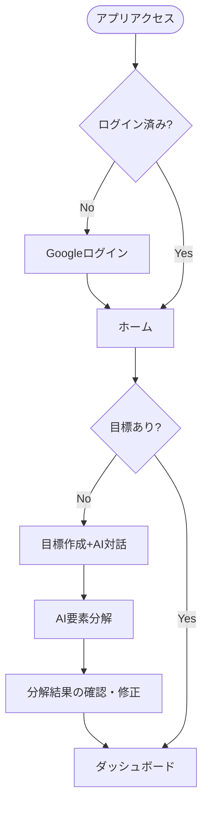
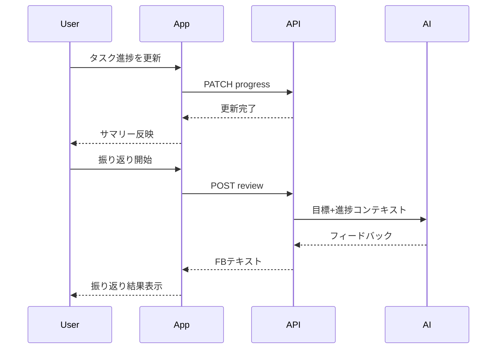
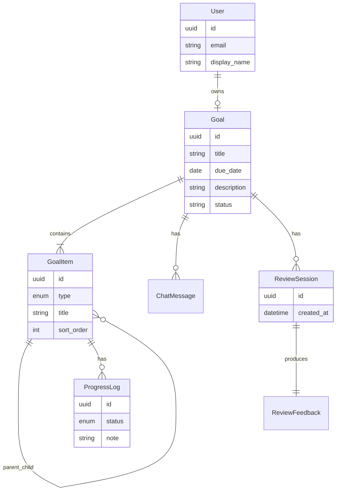

# 要件設計書

本ドキュメントは goal-ai-agent の MVP（最小機能）向け要件を定義する。技術スタックの詳細・DB スキーマ・API 仕様は別設計書で定義する。

関連ドキュメント: [draft.md](draft.md)（ビジョン・技術前提）、[procedure.md](procedure.md)（開発工程）

---

## 1. 概要・目的

### 1.1 背景

個人が目標を立て、達成状況を管理する際、目標の具体化や要素分解、振り返りは負荷が高い。本アプリケーションは AI エージェントがコーチング的に支援し、実行可能な粒度まで目標を落とし込むことを支援する。

### 1.2 目的

- ユーザーが **1件の目標** を AI と対話しながら具体化できること
- AI により目標を **最大3階層**（目標 → 中項目 → タスク）に分解できること
- タスク単位で進捗を記録し、全体の達成状況を把握できること
- ユーザーが任意のタイミングで **簡易振り返り** を行い、AI からフィードバックを得られること

### 1.3 成功指標（MVP）

| 指標 | 目標値 |
|------|--------|
| 初回目標の登録〜要素分解完了 | 登録後 30 分以内（ユーザー操作＋AI 応答含む） |
| ログイン〜ホーム表示 | 3 秒以内（ネットワーク正常時） |
| AI 応答（分解・振り返り） | 60 秒以内に応答開始、タイムアウト時は再試行可能 |

---

## 2. 用語定義

| 用語 | 定義 |
|------|------|
| ユーザー | Google アカウントで認証し、本アプリを利用する個人 |
| 目標（Goal） | ユーザーが達成したい成果。MVP では **同時に 1 件のみ** 保持 |
| 中項目（Milestone） | 目標を構成する中間の要素。目標の直下に配置 |
| タスク（Task） | 実行可能な最小単位の作業。中項目の直下に配置 |
| 要素分解 | 目標を中項目・タスクへ階層化する行為 |
| 進捗（Progress） | タスク（および必要に応じ中項目）の完了状態・メモ |
| 振り返り（Review） | ユーザーが手動で開始する振り返りセッションと、AI によるフィードバック |
| AI エージェント | 目標具体化・分解・振り返り FB を行う対話型エージェント |

---

## 3. ステークホルダー・ペルソナ

### 3.1 ステークホルダー

| ステークホルダー | 関心 |
|------------------|------|
| エンドユーザー（個人） | 目標達成の支援、使いやすい UI |
| 開発者 | 保守しやすい構成、コスト抑制 |
| 運用者（将来） | 可用性、障害対応 |

MVP では **エンドユーザー（個人利用）** のみを対象とする。

### 3.2 ペルソナ（MVP）

**田中 健太（32歳・会社員）**

- 副業や資格取得など個人目標を立てたいが、分解まで手が回らない
- スマホ・PC から Google アカウントで手軽に利用したい
- 週に数回、進捗を更新し、必要なときに AI に振り返りを求めたい

---

## 4. スコープ

### 4.1 MVP（In scope）

- Google アカウントによるログイン / ログアウト（Supabase Auth）
- 目標 **1 件** の作成・編集・参照
- AI との対話による目標の具体化
- AI による目標の要素分解（最大 3 階層）
- タスク単位の進捗記録とサマリー表示
- 手動トリガーの簡易振り返り（AI フィードバック）
- 個人データの分離（他ユーザーのデータは不可視）

### 4.2 将来（Out of scope for MVP）

- 複数目標の同時管理
- チーム・共有目標
- 定期通知・スケジュール振り返り
- 広告表示・収益化
- 管理者画面・分析ダッシュボード（運用向け）
- モバイルネイティブアプリ

---

## 5. 機能要件

| ID | 要件 | 優先度 | MVP |
|----|------|--------|-----|
| FR-001 | ユーザーは Google アカウントでログインできる | 必須 | Yes |
| FR-002 | ユーザーはログアウトできる | 必須 | Yes |
| FR-003 | ユーザーは目標を 1 件作成できる（タイトル・期限・説明） | 必須 | Yes |
| FR-004 | ユーザーは既存の目標を編集・参照できる | 必須 | Yes |
| FR-005 | ユーザーは AI と対話し、目標内容を具体化できる | 必須 | Yes |
| FR-006 | ユーザーは AI により目標を要素分解できる（目標→中項目→タスク、最大3階層） | 必須 | Yes |
| FR-007 | ユーザーは分解結果（中項目・タスク）を確認・手動で修正できる | 必須 | Yes |
| FR-008 | ユーザーはタスクごとに進捗（未着手/進行中/完了、任意メモ）を記録できる | 必須 | Yes |
| FR-009 | ユーザーは目標全体の進捗サマリー（完了率等）を確認できる | 必須 | Yes |
| FR-010 | ユーザーは任意のタイミングで振り返りを開始し、AI から FB を受け取れる | 必須 | Yes |
| FR-011 | ユーザーは 2 件目以降の目標を作成できない（MVP 制限） | 必須 | Yes |
| FR-012 | ユーザーは他ユーザーのデータにアクセスできない | 必須 | Yes |
| FR-013 | 複数目標の同時管理 | 将来 | No |
| FR-014 | 定期通知・スケジュール振り返り | 将来 | No |
| FR-015 | 広告表示・収益化 | 将来 | No |

### 5.1 FR 詳細（MVP 主要項目）

**FR-001 / FR-002（認証）**

- Supabase Auth の Google OAuth を使用する
- 未認証ユーザーは認証必須画面以外にアクセスできない

**FR-003 / FR-004（目標）**

- 必須項目: タイトル（最大 200 文字）、期限（日付）
- 任意項目: 説明（最大 2000 文字）
- MVP ではアクティブな目標は 1 件。新規作成前に既存目標がある場合は作成不可とする（または既存目標の編集へ誘導）

**FR-006 / FR-007（要素分解）**

- 階層: 目標（ルート）→ 中項目（1 段）→ タスク（2 段）
- 中項目・タスクはそれぞれ最大 20 件まで（AI 提案＋ユーザー編集）
- 分解は AI が提案し、ユーザーが承認・修正して確定する

**FR-008 / FR-009（進捗）**

- タスクの状態: `not_started` / `in_progress` / `completed`
- 完了率 = 完了タスク数 / 全タスク数（全タスク 0 件の場合は 0%）

**FR-010（振り返り）**

- ユーザーが「振り返る」操作でセッション開始
- 直近の進捗・目標内容をコンテキストに AI が FB を生成
- 振り返り履歴は参照可能（MVP では一覧表示のみ、詳細編集は不要）

---

## 6. 非機能要件

| ID | 要件 | 目標・方針 |
|----|------|------------|
| NFR-001 | 認証・認可 | 全 API・画面は認証必須。Row Level Security 等でユーザーデータを分離 |
| NFR-002 | データ保護 | 通信は HTTPS。秘密情報はクライアントに露出しない |
| NFR-003 | パフォーマンス | 画面初期表示 3 秒以内。AI 応答は 60 秒以内にストリーム開始または完了 |
| NFR-004 | 可用性 | MVP はベストエフォート。障害時はエラーメッセージと再試行を提示 |
| NFR-005 | コスト | OpenAI 呼び出しはユーザーあたり 1 日 50 リクエスト上限（設定で変更可能） |
| NFR-006 | UI/UX | モバイルファースト。主要操作は 3 タップ以内。ローディング・エラー状態を明示 |
| NFR-007 | ブラウザ | 最新 Chrome / Edge / Safari / Firefox（各 1 バージョン前まで） |
| NFR-008 | アクセシビリティ | フォームラベル・キーボード操作の基本対応（WCAG 2.1 A を目標） |
| NFR-009 | ログ | 認証失敗・AI エラー・5xx をサーバー側に記録（個人情報はマスク） |

---

## 7. ユーザーストーリーと受け入れ条件

### US-001 ログイン

**ストーリー:** 未ログインユーザーとして、Google でログインし、アプリのホームに遷移したい。そうすることで自分の目標データに安全にアクセスできる。

**受け入れ条件:**

- [ ] Google ログインボタンから Supabase Auth で認証できる
- [ ] 認証成功後、ホーム（ダッシュボード）にリダイレクトされる
- [ ] 認証失敗時、理由が分かるメッセージが表示される

### US-002 目標作成

**ストーリー:** ログイン済みユーザーとして、AI と対話しながら目標を 1 件登録したい。

**受け入れ条件:**

- [ ] タイトル・期限・説明を入力できる
- [ ] AI チャットで目標の具体化を支援される
- [ ] 既に目標がある場合、2 件目は作成できず案内が表示される

### US-003 要素分解

**ストーリー:** ログイン済みユーザーとして、登録した目標を AI に分解してもらい、実行可能なタスク一覧を得たい。

**受け入れ条件:**

- [ ] AI が中項目・タスクを提案する
- [ ] ユーザーが提案を編集・確定できる
- [ ] 確定後、目標詳細画面で階層構造が表示される

### US-004 進捗記録

**ストーリー:** ログイン済みユーザーとして、タスクの進捗を更新し、全体の完了率を確認したい。

**受け入れ条件:**

- [ ] 各タスクの状態を変更できる
- [ ] ダッシュボードに完了率が表示される
- [ ] 変更は即時反映される

### US-005 振り返り

**ストーリー:** ログイン済みユーザーとして、任意のタイミングで振り返りを行い、AI から改善のヒントを得たい。

**受け入れ条件:**

- [ ] 「振り返る」操作で FB が生成される
- [ ] 進捗・目標文脈が FB に反映される
- [ ] 振り返り結果を後から一覧で確認できる

---

## 8. 主要ユーザーフロー

### 8.1 初回利用フロー

### 8.2 進捗更新・振り返りフロー

---

## 9. 画面一覧（論理）

| 画面ID | 画面名 | 目的 | 主要要素 |
|--------|--------|------|----------|
| SCR-001 | ログイン | 認証 | Google ログインボタン、利用規約リンク（将来） |
| SCR-002 | ホーム / ダッシュボード | 目標・進捗の概要 | 目標タイトル、完了率、次のタスク、振り返り導線 |
| SCR-003 | 目標作成・編集 | 目標の入力 | フォーム、AI チャットパネル |
| SCR-004 | 要素分解 | 分解の確認・編集 | ツリー表示、AI 再提案、確定ボタン |
| SCR-005 | 目標詳細 | 階層・タスク一覧 | 中項目/タスクリスト、進捗操作 |
| SCR-006 | 振り返り | FB の取得・履歴 | 振り返り開始、FB 表示、過去一覧 |

画面遷移: SCR-001 →（認証後）→ SCR-002。目標未作成時は SCR-003 へ誘導。分解は SCR-003/004、日常利用は SCR-002/005/006。

---

## 10. AI エージェント要件

### 10.1 役割

| モード | 役割 | トリガー |
|--------|------|----------|
| コーチ | 目標の具体化を質問・提案で支援 | 目標作成時のチャット |
| 分解者 | 目標を中項目・タスクに分解 | 要素分解実行 |
| レビュアー | 進捗に基づく振り返り FB | 振り返り開始 |

### 10.2 入出力

- **入力:** ユーザーメッセージ、目標メタデータ、分解済み構造、進捗サマリー
- **出力:** 自然言語（日本語）。分解モードでは構造化データ（JSON）も返却可能

### 10.3 禁止・注意事項

- 医療・法律・金融投資など専門領域の断定的アドバイスをしない
- ユーザー以外のデータを参照・言及しない
- 不適切・差別的表現を生成しない（moderation 方針は技術設計で具体化）

### 10.4 会話履歴（MVP）

- 目標作成・分解セッションのメッセージは目標に紐づけて保存
- 振り返りセッションは Review 単位で保存
- 履歴保持期間: MVP では無期限（ストレージ圧迫時は将来アーカイブ）

---

## 11. 概念エンティティ（論理モデル）

DB 設計の入力とする。物理テーブルは [database.md](database.md) で定義する。

| エンティティ | 説明 |
|--------------|------|
| User | 認証ユーザー（Supabase Auth と対応） |
| Goal | ユーザーが管理する目標（MVP: 1 ユーザー 1 件） |
| GoalItem | 中項目またはタスク。`type`: `milestone` / `task` |
| ProgressLog | タスクの進捗状態の記録 |
| ChatMessage | AI 対話メッセージ（目標具体化・分解） |
| ReviewSession | 振り返りセッション |
| ReviewFeedback | セッションに紐づく AI FB 本文 |

---

## 12. 制約・前提

- 技術スタックは [draft.md](draft.md) に記載のとおり（Next.js, FastAPI, Supabase, OpenAI, LangChain/LangGraph 等）
- 認証は Supabase Auth（Google OAuth）
- MVP は個人利用のみ。マルチテナント・組織単位の権限は不要
- ホスティング・CI/CD の詳細は技術設計・インフラ工程で定義

---

## 13. 未決事項・次工程への引き継ぎ

| 項目 | 担当工程 |
|------|----------|
| ER 図・テーブル定義・RLS ポリシー | [database.md](database.md)（完了） |
| API エンドポイント・ディレクトリ構成 | [tech-stack.md](tech-stack.md)（完了） |
| OpenAI モデル選定・プロンプトテンプレート | [tech-stack.md](tech-stack.md)（方針）/ バックエンド実装（全文） |
| 1 日あたり AI リクエスト上限の実装方式 | [tech-stack.md](tech-stack.md)（方針）/ バックエンド実装 |
| テストライブラリ・カバレッジ方針 | [tech-stack.md](tech-stack.md)（完了） |
| 利用規約・プライバシーポリシー画面 | フロントエンド実装（またはリリース前） |

---

## 改訂履歴

| 版 | 日付 | 内容 |
|----|------|------|
| 0.1 | 2026-05-26 | 初版（MVP 最小・個人利用） |
