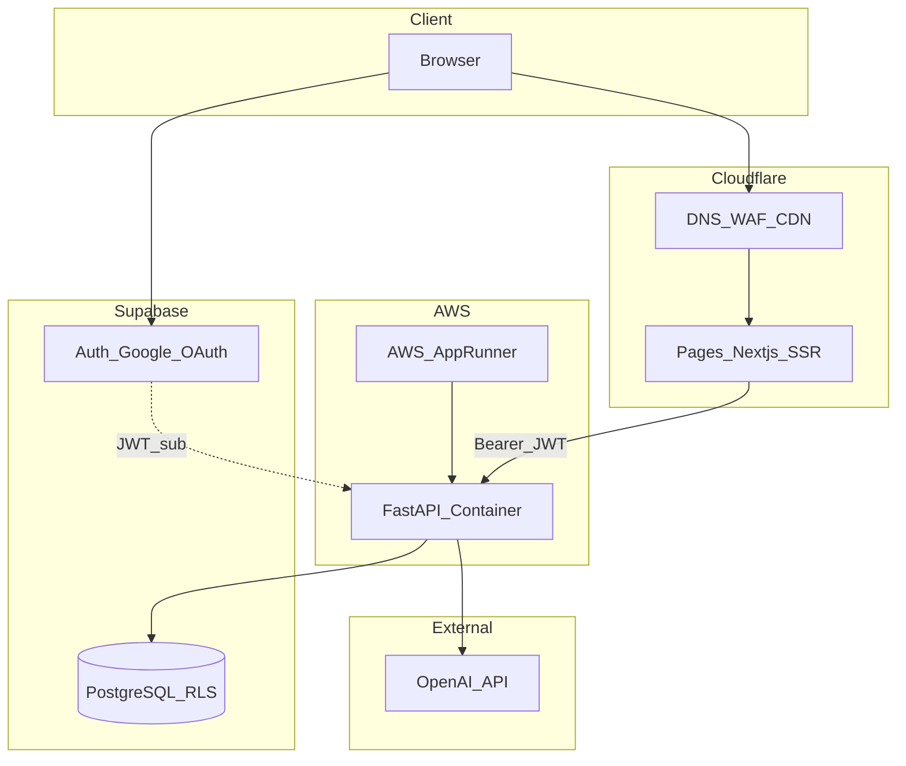
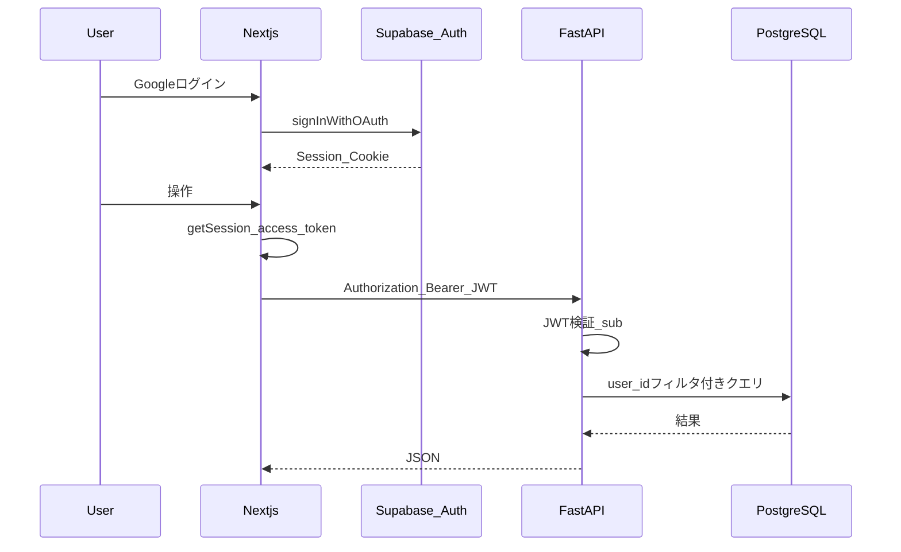

# 技術スタック設計書

本ドキュメントは goal-ai-agent の MVP 向け技術アーキテクチャ・API・リポジトリ構成・テスト方針を定義する。

関連ドキュメント: [requirements.md](requirements.md)、[database.md](database.md)、[draft.md](draft.md)、[procedure.md](procedure.md)

---

## 1. 概要・スコープ

### 1.1 目的

- [requirements.md](requirements.md) §13 の未決事項（API、テストライブラリ等）を解消する
- 実装工程（DDL、フロント、バックエンド、CI/CD、Terraform）の共通前提を提供する

### 1.2 MVP スコープ

[requirements.md](requirements.md) §4.1 に準拠。個人利用・目標 1 件・Google ログイン・AI 具体化/分解/振り返り。

### 1.3 本書で定義する / 定義しない

| 定義する | 定義しない（別工程） |
|----------|----------------------|
| システム構成・デプロイ概要 | Terraform モジュール詳細 |
| モノレポ構成・主要ライブラリ | プロンプト全文 |
| REST API 骨子・エラー形式 | GitHub Actions workflow ファイル |
| 認証フロー・CORS | OpenAPI の機械生成ファイル |
| FastAPI / Next.js ディレクトリ構成 | 画面の詳細 UI デザイン |
| AI モード・モデル選定方針 | 利用規約・プライバシーポリシー本文 |
| テスト方針・環境変数一覧 | |

---

## 2. システムアーキテクチャ

### 2.1 全体構成



### 2.2 レイヤー責務

| レイヤー | 技術 | 責務 |
|----------|------|------|
| フロントエンド | Next.js（Cloudflare Pages） | UI、Supabase Auth（Google OAuth）、JWT 取得、FastAPI 呼び出し |
| バックエンド | FastAPI（AWS） | 業務 CRUD、AI オーケストレーション、JWT 検証、`user_id` フィルタ、AI 日次上限 |
| 認証・DB | Supabase | Auth、PostgreSQL、RLS（防御層） |
| CDN / DNS | Cloudflare | フロント配信、DNS、WAF |
| AI | OpenAI | 対話・構造化出力・Moderation |

[database.md](database.md) §1.3 と整合:

- **業務データ:** クライアントは FastAPI のみ経由で CRUD
- **認証:** Next.js が Supabase Auth で Google OAuth
- **認可（正）:** FastAPI が JWT `sub` で全クエリをフィルタ
- **認可（防御）:** RLS を全業務テーブルに定義

### 2.3 クラウドサービス対応表

| 領域 | サービス | 用途 |
|------|----------|------|
| フロントホスティング | Cloudflare Pages | Next.js SSR 配信 |
| API ホスティング | **AWS App Runner（MVP）** | FastAPI コンテナ |
| DB / Auth | Supabase（マネージド） | PostgreSQL、Google OAuth |
| DNS / WAF | Cloudflare | ドメイン、キャッシュ、基本 WAF |
| AI | OpenAI API | GPT、Moderation |
| IaC（後工程） | Terraform | AWS + Cloudflare リソース |
| CI/CD（後工程） | GitHub Actions | PR: test/build、main: deploy |

### 2.4 API 到達経路

MVP では **ブラウザ → AWS App Runner（FastAPI）を直接呼び出す**（CORS 設定で Pages オリジンのみ許可）。

- Cloudflare 経由で API をプロキシする構成は将来オプション（同一ドメイン化・WAF 統一が必要な場合）
- Supabase REST（anon key）による業務データ直接アクセスは **行わない**

### 2.5 AWS ホスティング選定

**MVP: AWS App Runner**

- 単一コンテナ、最小インスタンス、オートスケール
- Supabase への接続はパブリック egress + Supabase connection pooling（Transaction mode）で足りる想定

ECS Fargate は **MVP の前提には含めない**（必要になった時点で代替案として検討する。詳細は §16.2）。

### 2.6 Cloudflare Pages + Next.js SSR

| 項目 | 方針 |
|------|------|
| Next.js | 15.x、App Router |
| Pages デプロイ | `@opennextjs/cloudflare` で OpenNext ビルドを Pages にデプロイ |
| 制約 | Edge Runtime 専用 API（一部 Node 組み込みモジュール）に依存する処理はサーバー Components / Route Handler で分離し、ビルド前に確認する |
| 環境変数 | `NEXT_PUBLIC_*` はクライアント露出可。秘密鍵はサーバー側のみ（NFR-002） |

---

## 3. リポジトリ構成（モノレポ）

```
goal-ai-agent/
  apps/
    web/                    # Next.js (App Router)
    api/                    # FastAPI
  supabase/
    migrations/             # DDL（database.md と整合）
    config.toml
  docker/
    compose.yml             # ローカル: web + api
  e2e/                      # Playwright
  design/                   # 設計書
  infra/                    # Terraform（後工程）
```

### 3.1 共有型・API 契約

- MVP では `packages/shared` は作らない（過剰抽象を避ける）
- FastAPI の OpenAPI から `openapi-typescript` でフロント型を生成する方針
- 生成物は `apps/web/src/types/api.generated.ts` に配置（CI で再生成、実装工程で導入）

---

## 4. バージョン・主要ライブラリ

| 領域 | 選定 | バージョン目安 | 備考 |
|------|------|----------------|------|
| Node.js | Node LTS | 22.x | Cloudflare Pages ビルド互換を CI で確認 |
| パッケージ管理 | pnpm | 9.x | `apps/web` |
| Next.js | App Router | 15.x | SSR: OpenNext + Pages |
| TypeScript | — | 5.x | strict |
| UI | Tailwind CSS + shadcn/ui | latest | NFR-006 モバイルファースト |
| Python | — | 3.12 | FastAPI コンテナ |
| 依存管理 | uv または pip + requirements | — | `apps/api` |
| FastAPI | — | 0.11x | Pydantic v2、OpenAPI 自動生成 |
| DB クライアント | SQLAlchemy 2（async）+ asyncpg | 2.x | repository 層で SQL 明示 |
| 認証検証 | PyJWT | — | Supabase JWT secret / JWKS |
| AI | openai SDK + LangGraph | — | LangChain はユーティリティ限定 |
| FE テスト | Vitest + React Testing Library + MSW | — | |
| BE テスト | pytest + httpx AsyncClient | — | |
| E2E | Playwright | — | [draft.md](draft.md) 確定済み |
| マイグレーション | Supabase CLI | — | `supabase/migrations/` |
| FE 認証 | @supabase/ssr | — | Cookie ベースセッション |

**DB クライアント選定理由:** `supabase-py` ではなく SQLAlchemy 2 + asyncpg とし、複雑な集計（完了率）・トランザクション（分解一括 INSERT）・`ai_usage_daily` の原子的 increment をアプリ層で明示的に制御する。

---

## 5. 認証・認可

### 5.1 フロー



### 5.2 実装要点

| # | 内容 |
|---|------|
| 1 | Next.js: `@supabase/ssr` で Google OAuth、HttpOnly Cookie でセッション管理 |
| 2 | API 呼び出し: `supabase.auth.getSession()` の `access_token` を `Authorization: Bearer` で送信 |
| 3 | FastAPI: JWT 検証 → `sub` = `current_user_id`、全 DB 操作に適用 |
| 4 | リソース取得: `goals.user_id = current_user_id` を必須（[database.md](database.md) §9.3） |
| 5 | **禁止:** service role key のクライアント露出（NFR-002） |
| 6 | CORS: 本番・プレビューの Pages URL のみ許可 |
| 7 | middleware: 未認証は `/login` 以外リダイレクト（FR-001） |

### 5.3 FastAPI 認証依存性

```python
# 概念例（実装工程で配置）
async def get_current_user_id(authorization: str = Header(...)) -> UUID:
    # JWT 検証 → sub を返す
    ...
```

---

## 6. REST API 設計

ベースパス: `/api/v1`。OpenAPI は FastAPI が `/openapi.json` で自動公開。

### 6.1 エンドポイント一覧

| メソッド | パス | 説明 | 要件 |
|----------|------|------|------|
| GET | `/health` | ヘルスチェック | 運用 |
| GET | `/me` | 自プロフィール | FR-001 |
| GET | `/goals/current` | 自ユーザーの目標 1 件（なければ 404） | FR-004, FR-011 |
| POST | `/goals` | 目標作成 | FR-003, FR-011 |
| PATCH | `/goals/{goal_id}` | 目標更新 | FR-004 |
| GET | `/goals/{goal_id}/items` | 階層ツリー（milestones + tasks） | FR-007, FR-009 |
| PATCH | `/goals/{goal_id}/items/{item_id}` | タスク進捗更新 | FR-008 |
| POST | `/goals/{goal_id}/items/bulk` | 分解確定・一括反映 | FR-006/007 |
| GET | `/goals/{goal_id}/chat/messages` | チャット履歴取得 | FR-005/006 |
| POST | `/goals/{goal_id}/chat/messages` | メッセージ送信 + AI 応答 | FR-005/006 |
| POST | `/goals/{goal_id}/reviews` | 振り返り開始 + FB 生成 | FR-010 |
| GET | `/goals/{goal_id}/reviews` | 振り返り一覧 | FR-010 |
| GET | `/goals/{goal_id}/summary` | 完了率・タスク集計 | FR-009 |

### 6.2 主要リクエスト / レスポンス（論理）

**POST `/goals`**

```json
{
  "title": "string (max 200)",
  "due_date": "YYYY-MM-DD",
  "description": "string | null (max 2000)"
}
```

- 既存目標がある場合: **409 Conflict**（FR-011）

**PATCH `/goals/{goal_id}/items/{item_id}`**（`item_type = task` のみ）

```json
{
  "status": "not_started | in_progress | completed",
  "note": "string | null (max 500)"
}
```

**POST `/goals/{goal_id}/items/bulk`**（分解確定）

- 最新 `decompose` の `chat_messages.metadata` を読み、既存 `goal_items` を DELETE 後 INSERT
- `goals.status = active`、`decomposition_confirmed_at = now()`（[database.md](database.md) §10.1）

**POST `/goals/{goal_id}/chat/messages`**

```json
{
  "content": "string",
  "session_kind": "coaching | decompose"
}
```

- 応答: SSE ストリーム（`text/event-stream`）を MVP デフォルト
- 完了後: `chat_messages` に user / assistant 行を INSERT
- `decompose` 時: assistant の `metadata` に提案 JSON を格納

**GET `/goals/{goal_id}/summary`**

```json
{
  "completion_rate_pct": 0.0,
  "task_total": 0,
  "task_completed": 0,
  "task_in_progress": 0,
  "task_not_started": 0,
  "next_task": { "id": "uuid", "title": "string" } | null
}
```

### 6.3 エラー形式

```json
{
  "code": "GOAL_ALREADY_EXISTS",
  "message": "ユーザーは既に目標を持っています",
  "details": {}
}
```

| HTTP | code 例 | 用途 |
|------|---------|------|
| 400 | `VALIDATION_ERROR` | 入力不正 |
| 401 | `UNAUTHORIZED` | JWT 無効・期限切れ |
| 403 | `FORBIDDEN` | 他ユーザーリソース |
| 404 | `NOT_FOUND` | リソースなし |
| 409 | `GOAL_ALREADY_EXISTS` | 2 件目目標（FR-011） |
| 429 | `AI_QUOTA_EXCEEDED` | 日次 AI 上限（NFR-005） |
| 500 | `INTERNAL_ERROR` | サーバーエラー |

### 6.4 認可チェック（全エンドポイント共通）

1. JWT から `current_user_id` を取得
2. `goal_id` を含む操作では `goals.user_id = current_user_id` を検証
3. 子リソース（items, messages, reviews）は親 goal の所有権を確認

### 6.5 AI 利用カウント

- 各 AI 呼び出し前に `ai_usage_daily` をチェック・increment（トランザクション内）
- 上限: 50 回/日/ユーザー（UTC、NFR-005、環境変数 `AI_DAILY_LIMIT` で変更可）
- 超過: **429** + `AI_QUOTA_EXCEEDED`

---

## 7. FastAPI 内部構成

```
apps/api/
  app/
    main.py
    core/
      config.py
      security.py       # JWT 検証
      logging.py
      dependencies.py   # get_current_user_id, get_db
    api/
      v1/
        router.py
        goals.py
        items.py
        chat.py
        reviews.py
        me.py
    services/
      goal_service.py
      item_service.py
      chat_service.py
      review_service.py
      ai_usage_service.py
    repositories/
      goal_repository.py
      ...
    schemas/
      goal.py
      item.py
      ...
    agents/
      coach_graph.py
      decompose_graph.py
      review_graph.py
      prompts/
    db/
      session.py
      base.py
  tests/
  Dockerfile
  pyproject.toml          # または requirements.txt
```

### 7.1 レイヤー規約

| レイヤー | 責務 |
|----------|------|
| `api/v1` | HTTP 入出力、ステータスコード、依存性注入 |
| `services` | ビジネスルール（FR-011、20 件上限、分解確定フロー） |
| `repositories` | SQLAlchemy クエリ |
| `agents` | LangGraph グラフ、OpenAI 呼び出し |
| `schemas` | Pydantic 入出力モデル |

---

## 8. Next.js 内部構成

```
apps/web/
  app/
    (auth)/
      login/page.tsx              # SCR-001
    (protected)/
      layout.tsx                  # 認証ガード
      dashboard/page.tsx          # SCR-002
      goals/
        new/page.tsx              # SCR-003
        [id]/page.tsx             # SCR-005
        [id]/decompose/page.tsx   # SCR-004
        [id]/review/page.tsx      # SCR-006
  components/
    ui/                           # shadcn
    goals/
    chat/
  lib/
    supabase/
      client.ts
      server.ts
      middleware.ts
    api-client.ts                 # FastAPI + Bearer
  middleware.ts                   # 未認証リダイレクト
```

### 8.1 画面と API 対応

| 画面 ID | パス | 主な API |
|---------|------|----------|
| SCR-001 | `/login` | Supabase Auth |
| SCR-002 | `/dashboard` | `GET /goals/current`, `GET .../summary` |
| SCR-003 | `/goals/new` | `POST /goals`, `POST .../chat/messages` |
| SCR-004 | `/goals/[id]/decompose` | `POST .../chat/messages`, `POST .../items/bulk` |
| SCR-005 | `/goals/[id]` | `GET .../items`, `PATCH .../items/{id}` |
| SCR-006 | `/goals/[id]/review` | `POST/GET .../reviews` |

### 8.2 状態管理

- サーバー状態: TanStack Query（React Query）で API キャッシュ・再取得
- フォーム: React Hook Form + Zod
- チャット SSE: 専用 hook で EventSource または fetch stream

---

## 9. AI 設計（MVP）

### 9.1 モードと LangGraph

| モード | グラフ | session_kind | モデル | 出力 |
|--------|--------|--------------|--------|------|
| コーチ | `coach_graph` | `coaching` | `gpt-4o-mini` | 日本語テキスト |
| 分解者 | `decompose_graph` | `decompose` | `gpt-4o` | JSON → `metadata` |
| レビュアー | `review_graph` | — | `gpt-4o-mini` | `feedback_text` |

- LangChain: プロンプトテンプレート、出力パーサ等のユーティリティに限定
- 状態管理・分岐: LangGraph

### 9.2 Moderation

- ユーザ入力ごとに OpenAI Moderation API を実行
- フラグ時は AI を呼ばず 400 + ユーザ向けメッセージ（requirements §10.3）

### 9.3 分解 JSON スキーマ

[database.md](database.md) §6.4 の `metadata` スキーマに準拠。

### 9.4 環境変数（AI 関連）

| 変数 | 説明 |
|------|------|
| `OPENAI_API_KEY` | API キー（サーバーのみ） |
| `OPENAI_MODEL_COACH` | デフォルト `gpt-4o-mini` |
| `OPENAI_MODEL_DECOMPOSE` | デフォルト `gpt-4o` |
| `OPENAI_MODEL_REVIEW` | デフォルト `gpt-4o-mini` |
| `AI_DAILY_LIMIT` | デフォルト `50` |

プロンプト全文は `apps/api/app/agents/prompts/` に配置（バックエンド実装工程）。

---

## 10. ローカル開発

### 10.1 Docker Compose

| サービス | ポート | 内容 |
|----------|--------|------|
| `web` | 3000 | `pnpm dev`（Next.js） |
| `api` | 8000 | `uvicorn app.main:app --reload` |

Supabase は **リモート dev プロジェクト**接続を MVP デフォルト。`supabase start` は任意（オフライン開発用）。

### 10.2 環境変数

`.env.example` をルートおよび `apps/web`、`apps/api` に配置（実装工程で作成）。秘密情報はコミットしない。

| 変数（例） | 配置 | 説明 |
|------------|------|------|
| `NEXT_PUBLIC_SUPABASE_URL` | web | Supabase プロジェクト URL |
| `NEXT_PUBLIC_SUPABASE_ANON_KEY` | web | anon key |
| `NEXT_PUBLIC_API_BASE_URL` | web | FastAPI（`http://localhost:8000`） |
| `SUPABASE_JWT_SECRET` | api | JWT 検証 |
| `DATABASE_URL` | api | Supabase Postgres 接続文字列 |
| `OPENAI_API_KEY` | api | OpenAI |
| `CORS_ORIGINS` | api | `http://localhost:3000` 等 |

---

## 11. デプロイ・環境

| 環境 | Frontend | Backend | DB |
|------|----------|---------|-----|
| local | localhost:3000 | localhost:8000 | Supabase dev |
| staging | Cloudflare Pages（preview） | App Runner staging | Supabase staging |
| prod | Cloudflare Pages prod | App Runner prod | Supabase prod |

### 11.1 CI/CD 骨子（後工程で実装）

| トリガー | 処理 |
|----------|------|
| PR → develop/main | lint、test、build（web + api） |
| merge → main | 上記 + CD（Pages + App Runner デプロイ） |

本工程では workflow ファイルは作成しない。

### 11.2 App Runner デプロイ概要

1. ECR に API イメージを push
2. App Runner サービスがイメージを pull・起動
3. 環境変数に `DATABASE_URL`、`SUPABASE_JWT_SECRET`、`OPENAI_API_KEY` 等を設定（Secrets Manager 連携は Terraform 工程）

---

## 12. テスト方針

| 層 | ツール | 対象 | MVP 目標 |
|----|--------|------|----------|
| FE 単体 | Vitest + RTL + MSW | コンポーネント、hooks | 認証ガード、進捗表示、完了率 |
| BE 単体 | pytest + httpx | services, repositories | JWT、FR-011、完了率 SQL |
| 契約 | OpenAPI snapshot（任意） | API スキーマ | 主要エンドポイント |
| E2E | Playwright | US-001〜005 | smoke 1 本 + 拡張は実装工程 |

### 12.1 E2E smoke シナリオ（案）

1. Google ログイン（テスト用 Auth またはモック）
2. 目標作成 → 分解確定 → タスク進捗更新 → 完了率表示
3. 振り返り実行 → FB 表示

---

## 13. セキュリティ・運用

| 項目 | 方針 |
|------|------|
| 通信 | 全環境 HTTPS（NFR-002） |
| 秘密情報 | クライアントに露出しない。App Runner / Pages の環境変数で注入 |
| ログ | 構造化 JSON。email 等 PII はマスク（NFR-009） |
| 認証失敗・AI エラー・5xx | サーバー側に記録 |
| レート制限 | AI は DB カウント。一般 API は将来 WAF / App Runner 設定 |

---

## 14. マイグレーション

[database.md](database.md) §12 の DDL 構成を `supabase/migrations/` に配置する。

```
supabase/migrations/
  20260101000000_enums.sql
  20260101000001_tables.sql
  20260101000002_indexes.sql
  20260101000003_functions_triggers.sql
  20260101000004_rls.sql
```

**実装順序:** ENUM → テーブル → インデックス → 関数・トリガー → RLS

**ツール:** Supabase CLI（`supabase db push` / `supabase migration up`）

---

## 15. 要件トレーサビリティ

| 要件 / 未決事項 | 本書での解決 |
|-----------------|--------------|
| API エンドポイント | §6 |
| テストライブラリ | §4, §12 |
| OpenAI モデル選定 | §9.1 |
| 1 日 AI 上限の実装方式 | §6.5, §9 |
| ディレクトリ構成 | §3, §7, §8 |
| DB マイグレーションツール | §14 |
| ホスティング | §2（Cloudflare + AWS App Runner + Supabase） |

---

## 16. リスク・確認事項

| リスク | 対策 |
|--------|------|
| OpenNext + Pages の Node API 制約 | ビルド CI で検出。Edge 非対応処理は分離 |
| App Runner のコールドスタート | 最小インスタンス 1（コストとトレードオフ） |
| App Runner の制約に抵触 | §16.2 の代替案（ECS Fargate）を検討 |
| CORS / 本番 URL 変更 | `CORS_ORIGINS` を環境ごとに管理 |

---

## 16.2 代替案（必要時のみ）: ECS Fargate

MVP では App Runner 前提とする。以下の条件に該当する場合のみ ECS Fargate を検討する。

- 組織標準が ECS / ALB
- VPC 内の他 AWS リソース（Secrets Manager、Private サブネット等）との統合が必須
- App Runner の制約（ネットワーク/スケール/デプロイ要件）に抵触

## 改訂履歴

| 版 | 日付 | 内容 |
|----|------|------|
| 0.1 | 2026-05-26 | 初版（Cloudflare Pages + AWS App Runner + Supabase） |
